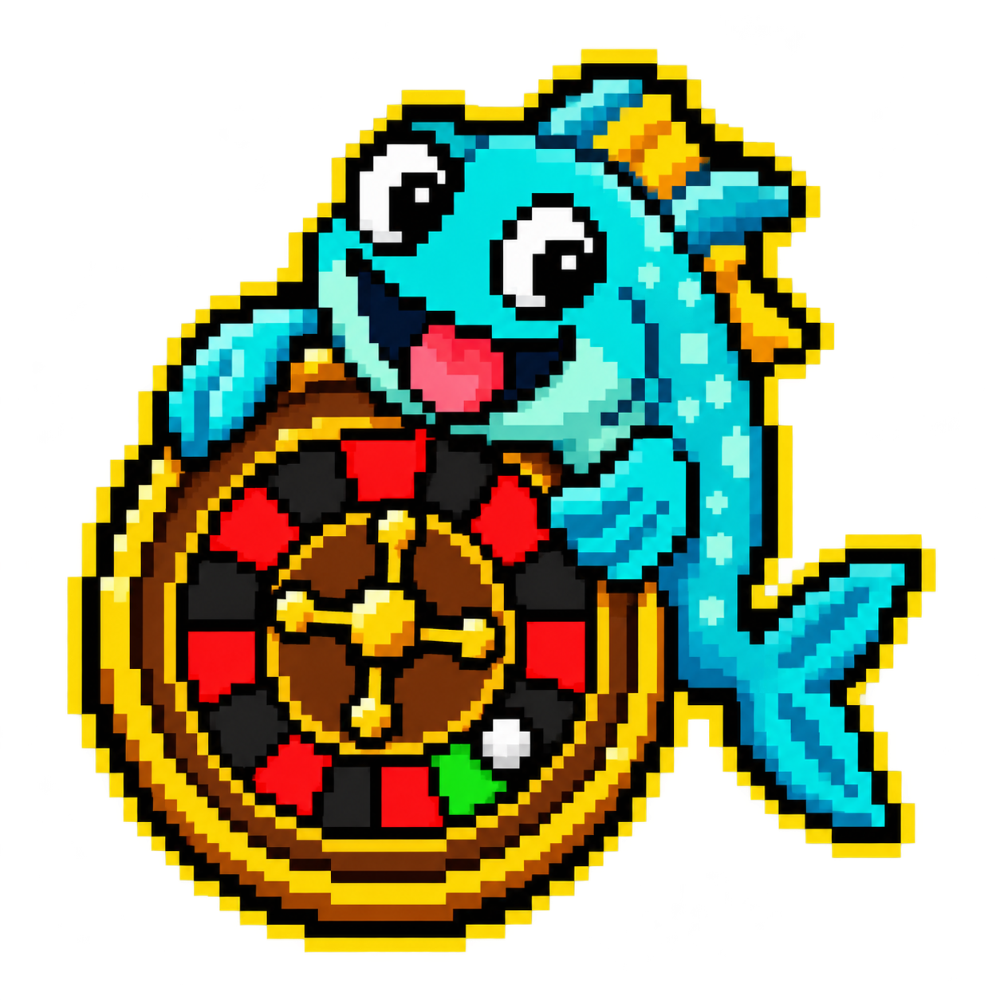

# RO — How to Fish Roulette Operator

<p align="center">
  
</p>

<p align="center">
  <strong>A tiny, playful single-player roulette cheat made for How to Fish.</strong><br>
  Pick black, red, or green and let RO steer the local roulette ball toward that color.
</p>

## About

RO began as a personal reverse-engineering experiment built purely for fun. The
project explores Unity assembly inspection, runtime hooks, physics control, and
safe build-specific patch generation. It is now available for anyone who wants
to study it, test it, or simply make some wonderfully silly bets.

The application installs a small local module into a compatible game build and
lets you choose the target color before a spin. It is intended for personal,
offline experimentation—not for harming the game, its developers, or other
players.

## Features

- Free, Black, Red, and Green modes
- Vibrant, fully English desktop interface
- Structural compatibility detection instead of a fixed game-version hash
- Support for standard and renamed Unity executables
- A patch generated locally for each compatible build
- Per-build SHA-256 backups and one-click restoration
- Safe refusal before modification when a build is incompatible
- Self-contained Windows x64 release

## Installation

1. Download the latest ZIP from [Releases](https://github.com/Zawtt/HowToFish-Roulette-Trainer/releases/latest).
2. Extract the complete ZIP to a folder.
3. Close *How to Fish*.
4. Run `How to Fish - Roulette Operator.exe`.
5. Select the game's executable if it is not found automatically.
6. Confirm that RO reports a compatible roulette structure.
7. Select **INSTALL / REPAIR**, open the game, and choose a color before spinning.

Use **FREE** to return the roulette to its unassisted behavior. Use **RESTORE
ORIGINAL** while the game is closed to restore the matching original assembly.

## Compatibility

RO locates the Unity `*_Data/Managed/Assembly-CSharp.dll` associated with the
selected executable and verifies the roulette types, methods, and fields it
needs. This works across known builds—and renamed installations—when that
structure remains compatible.

No tool can truthfully guarantee support for every future build. If an update
removes or renames a required member, RO refuses to patch it and leaves the game
untouched instead of guessing.

## Building from source

Requirements: Windows x64, .NET 8 SDK, and a locally installed copy of the game.

The repository does not redistribute Unity/game assemblies. First populate the
local reference folder from your own installation:

```powershell
.\scripts\setup-references.ps1 -GameExecutable "C:\Path\To\How to Fish.exe"
dotnet build .\HowToFish.RouletteTrainer.sln -c Release
```

## Safety and disclaimer

RO creates a SHA-256-addressed backup in `roulette-trainer-backups` before it
changes the active assembly. Patch output is written and verified separately
before replacement. Always close the game before installing, repairing, or
restoring.

The v1.0 executable is not digitally signed. Windows may therefore display an
unknown-publisher warning. Download releases only from this repository and
compare the ZIP against the published `SHA256SUMS.txt` before running it.

This is an unofficial, fan-made project. It is not affiliated with, endorsed by,
or supported by the creators or publishers of *How to Fish*. You are responsible
for how you use it and for complying with the game's terms and applicable rules.

## License

The original source code in this repository is available under the [MIT License](LICENSE).
Third-party components remain subject to their respective licenses.
